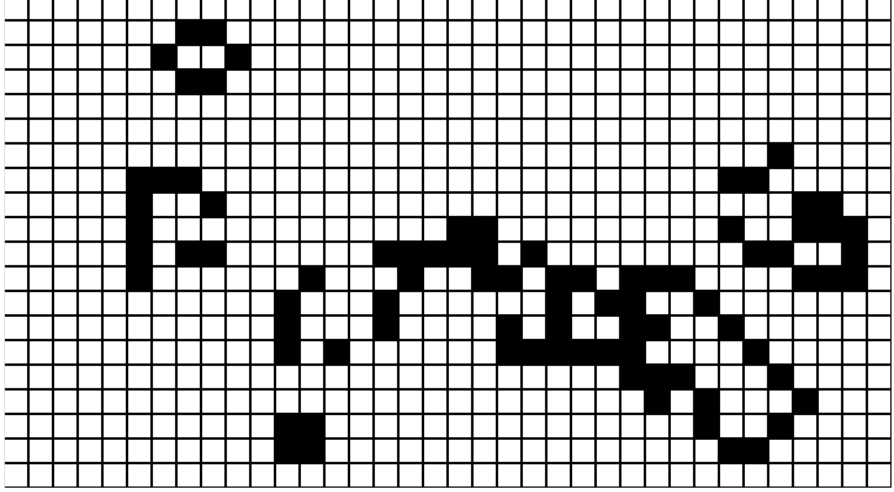
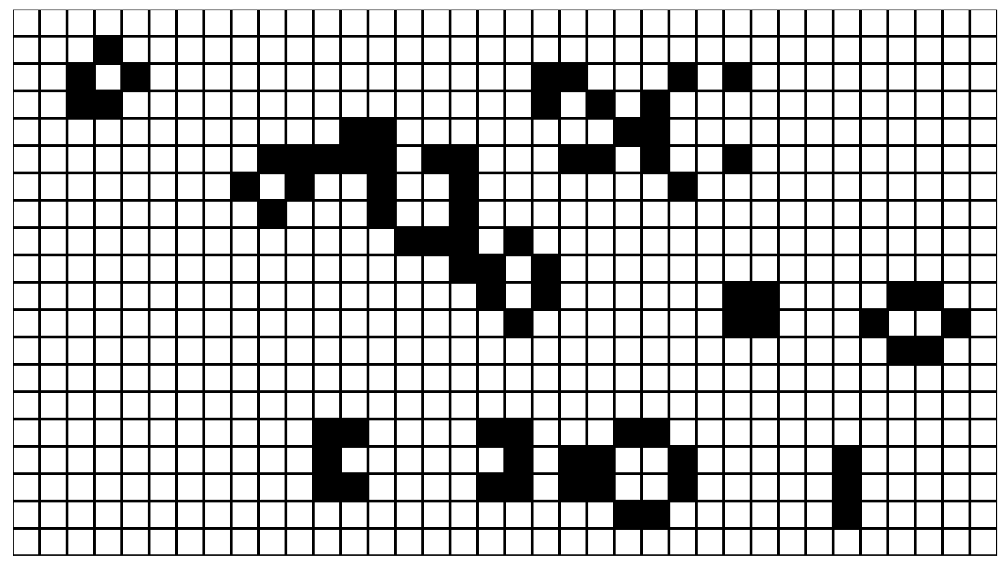
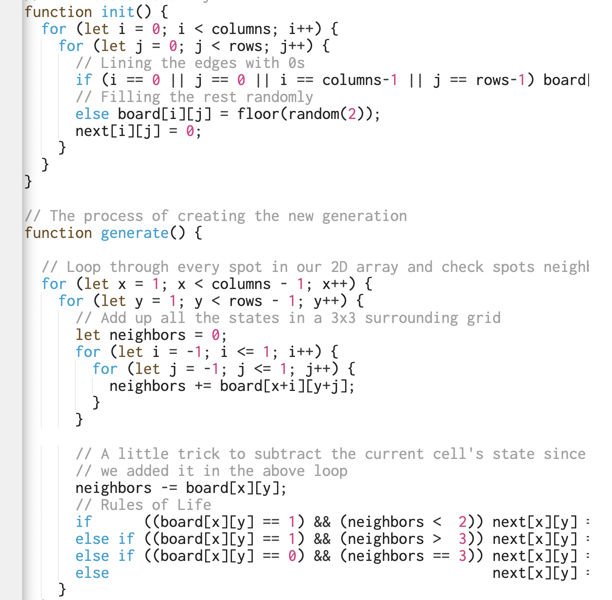

# yqiu0444_9103_tut5


## Week8-Quiz

### Part 1: ImagingTechnique Inspiration

#### The graphics in Super Mario use lots of bright, highly saturated colors to create a relaxing atmosphere for users. At the same time, the developer integrated the pixel art style and presented the characters, objects and backgrounds of the game with pixelated images, creating a vivid, lively and energetic game world for users, which has become a wonderful childhood memory for many people. I want to use this pixel art style and color scheme to create a brand new game scene, and also the user can trigger the game mechanism through the keyboard to make interesting changes in the screen.


### Part 2: Coding Technique Exploration


```
Regarding the pixelated style, this is the coding technique I referenced. 
```
[Link Text](https://p5js.org/examples/simulate-game-of-life.html)


#### This is a simple life game that uses JS to create a 2D array, the game iterates through the function generate() and checks if each square meets the required conditions to appear black or white. In my design, I also want to create a 2D array by calculating the number of columns and rows, and refer to the function init() and function generate() to reset the rules of change, and control the changing color of each small square in the screen to form different objects, but the choice of color needs to be thought.









